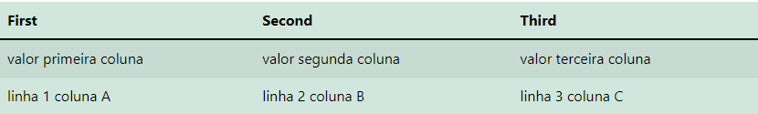

<!DOCTYPE html>
<html>
    <body>
        

        <a
            style="margin-left: 5px"
            href="https://github.com/createmeal/createmeal/graphs/contributors"
            ></a
        > <a
            style="margin-left: 5px"
            href="https://github.com/createmeal/createmeal/issues"
            ></a
        > <a
            style="margin-left: 5px"
            href="https://github.com/createmeal/createmeal/blob/master/LICENSE"
            ></a
        > 
        

            <h3>Createmeal</h3>
            

                HTML generator powered by json <a
                    href="#usage"
                    ><strong>Explore the docs »</strong></a
                >
            

            

                <a href="#">View Demo</a
                > · <a href="https://github.com/createmeal/createmeal/issues"
                    >Report Bug</a
                > · <a href="https://github.com/createmeal/createmeal/issues"
                    >Request Feature</a
                >
            

        

        

            
Table of Contents

            <ol>
                <li>
                    <a href="#about-the-project"
                        >About The Project</a
                    >
                    <ul>
                        <li>
                            <a href="#built-with">Built With</a>
                        </li>
                    </ul>
                </li>
                <li>
                    <a href="#getting-started">Getting Started</a>
                    <ul>
                        <li>
                            <a href="#installation"
                                >Installation</a
                            >
                        </li>
                    </ul>
                </li>
                <li>
                    <a href="#usage">Usage</a>
                    <ul>
                        <li>
                            <a href="#simple-example-of-usage-in-an-application"
                                >Simple example of usage in an
                                    application</a
                            >
                        </li>
                    </ul>
                </li>
                <li>
                    <a href="#roadmap">Roadmap</a>
                </li>
                <li>
                    <a href="#contributing">Contributing</a>
                </li>
                <li>
                    <a href="#license">License</a>
                </li>
                <li>
                    <a href="#contact">Contact</a>
                </li>
                <li>
                    <a href="#acknowledgments">Acknowledgments</a>
                </li>
            </ol>
        

        <section>
            <h2>About The Project</h2>
            

                HTML is the standard way to produce web page content and there
                are several other options to produce text estructures like
                markdown, jsml, WackoWiki Markup, AsciiDoc, Contentflow, and
                others. But to work with these alternatives at first you will
                need learn a new language, is not ease to produce content using
                javascript, and most of them has a strange sintax and some times
                worst then HTML.
            

            

                Createmeal gives us the same HTML tag names and semantic, but
                using json in its sintax. It decreases the need of learn a new
                language, gives us a better way to generate layout content
                powered by javascript, in additional to allow us storage source
                easilly in database if is needed, componentize, create
                templates, use other languages like yaml, and serialize text to
                object.
            

            

                Of course, for many people, HTML is excelent, but is great when
                you have good alternatives to solve problems, and turn live
                better.
            

            

                <a href="#top">back to top</a>
            

        </section>
        <section>
            <h3>Built With</h3>
            

                The entire library is actually created using javascript and the
                dependences and HTML is used only for Development and testing,
                and example porpose.
            

        </section>
        <section>
            <h2>Getting Started</h2>
            

                Try to accessing the guide for complete reference: <a href="#usage"><strong>Getting Started</strong></a>
            

            <h3>Installation</h3>
            <ul>
                <li>
                    npm
                    <pre><code>npm i createmeal</code></pre>
                </li>
                <li>
                    CDN
                    <pre><code>&lt;script src="https://cdn.jsdelivr.net/npm/createmeal@1.0.0/dist/createmeal.min.js"&gt;&lt;/script&gt;</code></pre>
                </li>
            </ul>
        </section>
        <section>
            <h2>Usage</h2>
            

                
                    The main metod of createmeal is toHtml({}), so
                    createmeal.toHtml({div:{}}), will return
                    &lt;div&gt;&lt;/div&gt;.
                
            

            <h3>Examples</h3>
            <ul>
                <li>
                    attributes
                    <pre><code>toHtml({
    div:{
        class:["container"]
    }
}) 
//&lt;tagName class="container"&gt;&lt;tagName class="container"&gt;</code></pre>
                </li>
                <li>
                    textContent
                    <pre><code>
toHtml({
    p:["Hello World!"]
}) 
//&lt;p&gt;Hello World!&lt;p&gt;
</code></pre>
                </li>
                <li>
                    table
                    <pre><code>
{
    table:{
        class: "table table-success table-striped table-hover",
        thead: { 
            tr: [
                { 
                    th: ["First"] 
                }, 
                { th: ["Second"] }, 
                { th: ["Third"] }
            ]
        },
        tbody: [
            {
                tr: [
                    { 
                        td: ["valor primeira coluna"] 
                    },
                    { td: ["valor segunda coluna"] },
                    { td: ["valor terceira coluna"] },
                ],
            },
            {
                tr: [
                    { td: ["linha 1 coluna A"] },
                    { td: ["linha 2 coluna B"] },
                    { td: ["linha 3 coluna C"] },
                ],
            },
        ],
    }
}
//result of table generation:
&lt;table class="table table-success table-striped table-hover"&gt;
    &lt;thead&gt;
        &lt;tr&gt;
            &lt;th&gt;First&lt;/th&gt;
            &lt;th&gt;Second&lt;/th&gt;
            &lt;th&gt;Third&lt;/th&gt;
        &lt;/tr&gt;
    &lt;/thead&gt;
    &lt;tbody&gt;
        &lt;tr&gt;
            &lt;td&gt;valor primeira coluna&lt;/td&gt;
            &lt;td&gt;valor segunda coluna&lt;/td&gt;
            &lt;td&gt;valor terceira coluna&lt;/td&gt;
        &lt;/tr&gt;
        &lt;tr&gt;
            &lt;td&gt;linha 1 coluna A&lt;/td&gt;
            &lt;td&gt;linha 2 coluna B&lt;/td&gt;
            &lt;td&gt;linha 3 coluna C&lt;/td&gt;
        &lt;/tr&gt;
    &lt;/tbody&gt;
&lt;/table&gt;
</code></pre>
                </li>
                <h1 align="center">
                    
                </h1>
            </ul>
            <h3>Simple example of usage in an application</h3>
            <ul>
                <li>
                    CDN
                    <pre><code>
&lt;html&gt;
    &lt;body&gt;
        &lt;script src="https://cdn.jsdelivr.net/npm/createmeal@1.0.0/dist/createmeal.min.js"&gt;&lt;/script&gt;
        &lt;script&gt;
        let helloWorld = {
            div: [
                    {
                        class: "container"
                    },
                    {
                        h3: ["Hello World!"]
                    },
                    {
                        p: ["This is a simple way to generate DOM without write HTML."]
                    }
                ]
            }
            let html = createmeal.toHtml(helloWorld);
            let element = new DOMParser().parseFromString(html,"text/html").body.firstChild;
            document.body.insertBefore(element,document.body.firstChild);
        &lt;/script&gt;
    &lt;/body&gt;
&lt;/html&gt;                    
</code></pre>
                </li>
                <li>
                    CDN Result
                    <pre><code>&lt;html lang="en"&gt;
    &lt;head&gt;
        &lt;title&gt;Create App With CDN&lt;/title&gt;
    &lt;/head&gt;
    &lt;body&gt;
        &lt;div class="container"&gt;
            &lt;h3&gt;Hello World!&lt;/h3&gt;
            &lt;p&gt;This is a simple way to generate DOM without write HTML.&lt;/p&gt;
        &lt;/div&gt;
    &lt;/body&gt;
&lt;/html&gt;
</code></pre>
                </li>
            </ul>
        </section>
        <h2>Roadmap</h2>
        <h2>Contributing</h2>
        <h2>License</h2>
        <h2>Contact</h2>
        <h2>Acknowledgments</h2>
    </body>
</html>
